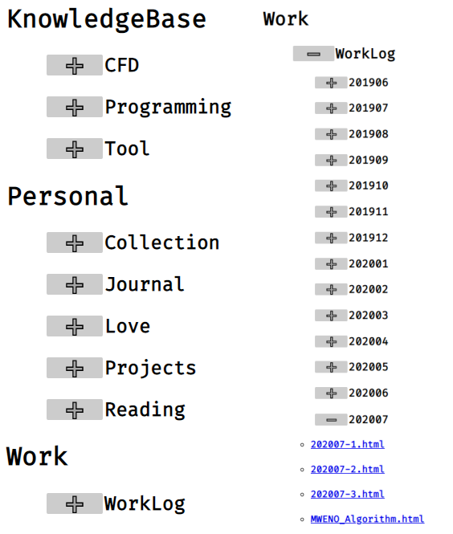

# Overview

Simple Notes Manager(SNM) converts markdown files to html file and organizes them in another directory. It also generates index.html as a summary of them. Then it monitors any change in the source directory to process them in the real-time.

Publish cmd: `dotnet publish -c Release -r win-x64 -p:PublishReadyToRun=true -p:PublishSingleFile=true -p:PublishSingleFile=true`.

# Screenshots

# Requirements

None.

# Usage

Directly download the file in this [Github repo](https://github.com/jingchangshi/NoteProject).
It contains the executable to start the note manager.

## Configurations

Check the example `monitor.json` in the `doc` directory.

